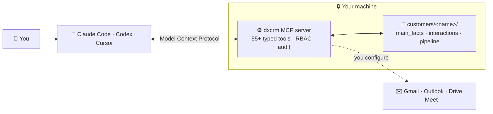

<div align="center">

# Datasynx Agentic CRM &middot; `dxcrm`

### The CRM your AI agents actually run.

**Local-first. MCP-native. One autonomous agent per customer.**
Your pipeline lives as plain Markdown on your machine — and your AI agents read, reason about, and update it natively inside Claude Code, Codex, and Cursor.

<p>
<a href="#-quickstart"><strong>Quickstart</strong></a> &middot;
<a href="https://datasynx-ai.github.io/datasynx-crm/"><strong>Docs</strong></a> &middot;
<a href="https://www.npmjs.com/package/@datasynx/agentic-crm"><strong>npm</strong></a> &middot;
<a href="https://github.com/datasynx-ai/datasynx-crm"><strong>GitHub</strong></a> &middot;
<a href="https://de.linkedin.com/company/datasynx-ai"><strong>LinkedIn</strong></a>
</p>

[](https://www.npmjs.com/package/@datasynx/agentic-crm)
[](https://www.npmjs.com/package/@datasynx/agentic-crm)
[](https://github.com/datasynx-ai/datasynx-crm/actions/workflows/ci.yml)
[](https://datasynx-ai.github.io/datasynx-crm/)
[](https://github.com/datasynx-ai/datasynx-crm/stargazers)
[](./LICENSE)
[](https://nodejs.org)

</div>

> **You don't open a CRM to find your customer. Your customer's agent finds _you_ — briefed, current, and ready to act.**

Your AI agents are brilliant — and forgetful. **Datasynx Agentic CRM is the long-term memory and the hands** they use to run your customer relationships. Every customer is a folder of human-readable Markdown on your own disk; **55+ purpose-built [Model Context Protocol](https://modelcontextprotocol.io) tools** let any agent load full context, score deals, forecast revenue, draft the follow-up, and log what happened — without you copy-pasting a thing.

**No database. No cloud lock-in. No per-seat pricing. Zero telemetry.**

<br/>

## See it in action

```text
You    ▸  What's going on with Acme Corp?

Agent  ▸  ⟢ get_customer_context · get_deal_health · get_relationship_health

          Acme Corp — Negotiation · €75,000 · deal health B (78/100)
          • Last touch 2 days ago — pricing pushback from the CFO
          • Champion: VP Engineering (warm)   ⚠ Economic buyer quiet for 11 days
          • Next best action: send the ROI one-pager, loop the VP Eng into the thread

You    ▸  Draft that follow-up and log it.

Agent  ▸  ⟢ draft_email · log_interaction
          ✓ Draft ready (personalized from your "ROI follow-up" template)
          ✓ Logged to customers/acme-corp/interactions.md
```

> Every answer is grounded in Markdown files **you own** and can open in any editor. Nothing is hidden in a vendor database.

<br/>

## How it works



|        | Step              | What happens                                                                 |
| ------ | ----------------- | ---------------------------------------------------------------------------- |
| **01** | `dxcrm init`      | Detects & wires up Claude Code, Codex, Cursor, Claude Desktop — one command. |
| **02** | Bring your data   | `dxcrm create`, import from HubSpot/Salesforce/Pipedrive/CSV, or sync Gmail. |
| **03** | Just ask          | Your agent briefs you, drafts emails, forecasts, and logs — grounded in your files. |

<br/>

<div align="center">

**Works with** &nbsp;·&nbsp; 🟣 Claude Code &nbsp;·&nbsp; 🟢 Codex &nbsp;·&nbsp; 🔵 Cursor &nbsp;·&nbsp; 🟠 Claude Desktop &nbsp;·&nbsp; 🔌 any MCP client
<br/><sub>If it speaks the Model Context Protocol, it's connected.</sub>

</div>

<br/>

## Datasynx Agentic CRM is right for you if

- ✅ You **live in Claude Code / Codex / Cursor** and want your CRM there too — not in another browser tab.
- ✅ You want customer data as **plain files you own**, versionable in Git, readable forever.
- ✅ You're done **pasting context into prompts** — your agent should already know the account.
- ✅ You want **deal scoring, forecasting, and next-best-actions** on demand, not a quarterly export.
- ✅ You care about **privacy & GDPR** — local-first, built-in erasure, and zero telemetry.
- ✅ You want a CRM you can **fork and extend in TypeScript**, not file a feature request and wait.

<br/>

## Features

<table>
<tr>
<td align="center" width="33%">
<h3>📁 Markdown-native data</h3>
Every customer is a folder of <code>main_facts</code>, <code>interactions</code>, and <code>pipeline</code> files. Git-friendly, grep-able, yours forever.
</td>
<td align="center" width="33%">
<h3>🔌 55+ MCP tools</h3>
Typed tools for context, deals, comms, and intelligence — discoverable by agents via <code>get_capabilities</code>.
</td>
<td align="center" width="33%">
<h3>🧠 Deal & relationship IQ</h3>
Deal-health grades, relationship graphs, champion/blocker maps, and next-best-action recommendations.
</td>
</tr>
<tr>
<td align="center">
<h3>📈 Revenue forecasting</h3>
Weighted pipeline plus a Monte Carlo simulation (P10/P50/P90) and at-risk-revenue analysis.
</td>
<td align="center">
<h3>✉️ Comms that close</h3>
Email templates, multi-step sequences, HTML quotes, tickets with SLAs, and NPS/CSAT surveys.
</td>
<td align="center">
<h3>🔎 Hybrid memory</h3>
Vector + full-text search across every synced email, call transcript, and email attachment — PDFs, Office docs and images converted to Markdown and indexed on-device (LanceDB).
</td>
</tr>
<tr>
<td align="center">
<h3>🔐 Enterprise controls</h3>
Role-based access, an append-only audit trail, and an AES-256-GCM credential vault.
</td>
<td align="center">
<h3>🛡️ Privacy by design</h3>
Local-first storage, one-command GDPR erasure, and <strong>zero telemetry</strong>.
</td>
<td align="center">
<h3>🤖 Wake-triggered agents</h3>
An agent per customer pings you (Telegram) the moment a relevant email lands.
</td>
</tr>
</table>

<br/>

## Without vs. with Datasynx Agentic CRM

| Without                                                                          | With                                                                                      |
| -------------------------------------------------------------------------------- | ----------------------------------------------------------------------------------------- |
| ❌ You paste account context into every prompt — and still miss things.          | ✅ One MCP call loads the full, current briefing. The agent already knows the account.    |
| ❌ Per-seat SaaS; your customer data lives in someone else's cloud.              | ✅ Free & open source (MIT). Data is plain Markdown on your machine.                      |
| ❌ Switch to a separate CRM UI to update a deal.                                 | ✅ Your agent updates the pipeline in place, from inside Claude Code / Codex / Cursor.    |
| ❌ "What exactly did we promise Acme in March?"                                  | ✅ Hybrid search over every synced email and transcript answers in seconds.               |
| ❌ Forecasting means wrangling a spreadsheet.                                    | ✅ Weighted + Monte Carlo forecast on demand, with at-risk revenue flagged.               |
| ❌ A security/GDPR review triggers a fire drill.                                 | ✅ `dxcrm security-report`, built-in GDPR erasure, RBAC, and audit logging out of the box.|

<br/>

## Why it's different

|                                |                                                                                                               |
| ------------------------------ | ------------------------------------------------------------------------------------------------------------- |
| **Local-first by default.**    | Customers are Markdown folders on your disk. No database to run, no cloud to trust.                           |
| **MCP-native, not bolted-on.** | Agents call typed tools — not a scraped UI — with RBAC and an audit trail on every write.                    |
| **Grounded answers.**          | Every response traces back to files you can open and verify. No hallucinated pipeline.                        |
| **Hybrid recall.**             | Vector + full-text search over your synced inbox and call transcripts, fully on-device.                       |
| **Zero telemetry.**            | The CLI and MCP server phone home to nothing. The only outbound calls are integrations you explicitly enable. |
| **Yours to extend.**           | MIT-licensed TypeScript. Fork it, add a tool, ship it.                                                        |

<br/>

## What's under the hood

`dxcrm` is a CLI **and** an MCP server. One install gives your agents a complete revenue toolkit:

```
┌──────────────────────────────────────────────────────────────────┐
│                   dxcrm MCP server  ·  55+ tools                    │
│                                                                    │
│  ┌────────────┐ ┌────────────┐ ┌────────────┐ ┌────────────────┐  │
│  │  Customer  │ │  Pipeline  │ │Relationship│ │   Forecasting   │  │
│  │  Context   │ │  & Deals   │ │   Graph    │ │ (Monte Carlo)   │  │
│  └────────────┘ └────────────┘ └────────────┘ └────────────────┘  │
│  ┌────────────┐ ┌────────────┐ ┌────────────┐ ┌────────────────┐  │
│  │ Email · Seq│ │  Quotes ·  │ │ Tickets ·  │ │ Knowledge Base  │  │
│  │  · Drafts  │ │  Booking   │ │  Surveys   │ │  & Playbooks    │  │
│  └────────────┘ └────────────┘ └────────────┘ └────────────────┘  │
│  ┌────────────┐ ┌────────────┐ ┌────────────┐ ┌────────────────┐  │
│  │   RBAC ·   │ │   GDPR ·   │ │ Encrypted  │ │  Goals · Agents │  │
│  │   Audit    │ │  Erasure   │ │   Vault    │ │  · Approvals    │  │
│  └────────────┘ └────────────┘ └────────────┘ └────────────────┘  │
└──────────────────────────────────────────────────────────────────┘
        ▲                ▲                ▲                ▲
  ┌─────┴─────┐   ┌──────┴─────┐   ┌──────┴─────┐   ┌──────┴──────┐
  │  Claude   │   │   Codex    │   │   Cursor   │   │ HTTP / team │
  │   Code    │   │            │   │            │   │   server    │
  └───────────┘   └────────────┘   └────────────┘   └─────────────┘

  Sync in:  Gmail · Outlook · Google Drive · Teams · Google Meet
  Import:   HubSpot · Salesforce · Pipedrive · CSV
```

→ Full reference: **[54 CLI commands](https://datasynx-ai.github.io/datasynx-crm/#full-cli-reference)** · **[55+ MCP tools](https://datasynx-ai.github.io/datasynx-crm/#full-mcp-reference)**

<br/>

## 🚀 Quickstart

> **Requirements:** Node.js ≥ 20. Free and self-hosted — no account required.

```bash
npm install -g @datasynx/agentic-crm

dxcrm init                                   # detect & configure Claude Code, Codex, Cursor, ...
dxcrm create "Acme Corp" --domain acme.com   # create your first customer
```

Now open your AI agent and ask: **"What's the status on Acme Corp?"** — you'll get a grounded, current brief in seconds.

Migrating? Bring your existing data with you:

```bash
dxcrm import ./hubspot-export/ --from hubspot   # also: salesforce · pipedrive · csv
dxcrm sync acme-corp                            # pull Gmail threads + transcripts
```

Syncing Gmail also downloads every attachment, converts it to Markdown
(PDF, DOCX, XLSX, PPTX, CSV, HTML, and images via on-device OCR), stores it under
`customers/<slug>/attachments/`, links it from `interactions.md`, and indexes the
text into LanceDB so it's semantically searchable. Export a complete, sendable
bundle of all conversations and documents for a customer with the
`export_customer` MCP tool (`includeAttachmentContent: true`).

Beyond Gmail, `dxcrm mailbox sync` connects **any IMAP mailbox** — Outlook/Office365,
Fastmail, Yahoo, or a custom company inbox — and **auto-routes every message to the
right customer by sender/recipient domain** (or to one customer with a slug). One
mailbox connection, all customers populated, same attachment + search pipeline.

```bash
# One-time OAuth (Gmail & Microsoft 365 require it for IMAP in 2026):
dxcrm mailbox login gmail --user you@gmail.com
dxcrm mailbox login microsoft --user you@org.com

# Then auto-route the whole mailbox to customers by domain:
dxcrm mailbox sync --account gmail:you@gmail.com
```

Tokens are stored locally and auto-refreshed. A password-based IMAP server works too
(`DXCRM_IMAP_HOST` / `DXCRM_IMAP_USER` / `DXCRM_IMAP_PASS`).

<br/>

## What it's not

|                              |                                                                                              |
| ---------------------------- | -------------------------------------------------------------------------------------------- |
| **Not another SaaS tab.**    | It lives inside your AI agent and your filesystem — not a browser dashboard you have to open. |
| **Not a database.**          | Customers are Markdown folders. Back them up with `cp`, version them with `git`.              |
| **Not a chatbot wrapper.**   | 55+ typed MCP tools with RBAC and audit — not a single prompt pretending to be a product.      |
| **Not a data grab.**         | Zero telemetry. Your data never leaves your machine unless you wire up an integration.        |
| **Not lock-in.**             | MIT-licensed, plain files, export anytime. Leaving is a `cp -r` away.                         |

<br/>

## Built for teams

Run `dxcrm` solo, or stand up a shared MCP server for the whole revenue org:

- **Shared HTTP MCP server** — `dxcrm server` exposes the same tools to every teammate's agent.
- **RBAC** — `admin` / `manager` / `rep` roles scope what each actor (and their agent) can read and write.
- **SSO** — authenticate via WorkOS.
- **Audit & compliance** — append-only audit trail, one-command GDPR erasure, and `dxcrm security-report` for vendor reviews.

→ See the [Deployment](./docs/deployment.md) and [Team Setup](./docs/team-setup.md) guides.

<br/>

## FAQ

**Where does my data live?**
In a folder you choose, as Markdown files. No database, no cloud. Back it up and version it like code.

**Which AI tools work with it?**
Anything that speaks MCP — Claude Code, Codex, Cursor, Claude Desktop, and more. `dxcrm init` auto-configures the ones it detects.

**Is it really free?**
Yes. MIT-licensed and self-hosted. No seats, no metering.

**Can a whole team use it?**
Yes — run the shared HTTP MCP server with RBAC and SSO. See [Team Setup](./docs/team-setup.md).

**Can I migrate from HubSpot / Salesforce / Pipedrive?**
Yes — `dxcrm import` brings in contacts and activity history. CSV is supported too.

**Does it send my data anywhere?**
No telemetry, ever. The only outbound calls are the integrations you explicitly configure (e.g. Gmail) and the LLM your agent already uses.

<br/>

## Documentation

📖 **Full docs site:** **[datasynx-ai.github.io/datasynx-crm](https://datasynx-ai.github.io/datasynx-crm/)**

- [Quickstart — real Gmail in 5 minutes](./docs/quickstart-real.md)
- [CLI Reference](./docs/cli-reference.md) · [MCP Tools](./docs/mcp-tools.md) · [Schemas](./docs/schemas.md)
- [Framework Integrations](./docs/integrations.md) · [Deployment](./docs/deployment.md) · [Team Setup](./docs/team-setup.md)
- [Compliance](./docs/compliance.md)

<br/>

## Development

```bash
git clone https://github.com/datasynx-ai/datasynx-crm
cd datasynx-crm
npm ci

npm test               # Vitest (TDD) — 3000+ tests
npm run build          # tsdown → dist/
npm run typecheck      # strict TypeScript
npm run lint           # ESLint (zero warnings)
npm run docs:generate  # regenerate the CLI/MCP reference from code
```

New contributors: start with **[CONTRIBUTING.md](./CONTRIBUTING.md)** (TDD workflow, Conventional Commits, docs generation). The published reference is generated from code and guarded by a drift test, so the docs can never fall behind what ships.

<br/>

## Roadmap

**Shipped**

- ✅ 55+ MCP tools · 54 CLI commands · local-first Markdown store
- ✅ Hybrid (vector + full-text) search over emails & transcripts
- ✅ Sync: Gmail, Outlook, Google Drive, Teams, Google Meet
- ✅ Import: HubSpot, Salesforce, Pipedrive, CSV
- ✅ Deal health, relationship graph/health, Monte Carlo forecasting
- ✅ Email templates & sequences, quotes, tickets (SLA), NPS/CSAT, knowledge base
- ✅ RBAC, append-only audit, AES-256-GCM vault, GDPR erasure
- ✅ Shared HTTP MCP server, SSO (WorkOS), outbound webhooks
- ✅ Wake-triggered per-customer agents (Telegram)

**Exploring**

- ⚪ More notification channels (Slack, WhatsApp)
- ⚪ Optional read-only web dashboard
- ⚪ Additional LLM providers for on-device summarization
- ⚪ Community plugin marketplace

<br/>

## Community & Links

- 📦 **npm** — [@datasynx/agentic-crm](https://www.npmjs.com/package/@datasynx/agentic-crm)
- 💻 **GitHub** — [datasynx-ai/datasynx-crm](https://github.com/datasynx-ai/datasynx-crm)
- 🐛 **Issues** — [report a bug or request a feature](https://github.com/datasynx-ai/datasynx-crm/issues)
- 🔒 **Security** — [report a vulnerability privately](./SECURITY.md)
- 🤝 **Contributing** — [CONTRIBUTING.md](./CONTRIBUTING.md) · [Code of Conduct](./CODE_OF_CONDUCT.md)
- 💼 **LinkedIn** — [Datasynx AI](https://de.linkedin.com/company/datasynx-ai)

<br/>

## Star History

[](https://www.star-history.com/#datasynx-ai/datasynx-crm&Date)

<br/>

## License

MIT &copy; 2026 [Datasynx](https://github.com/datasynx-ai)

<br/>

---

<div align="center">
<sub>Built with TypeScript · Powered by the Model Context Protocol · Your data, your machine, your agents.</sub>
</div>
